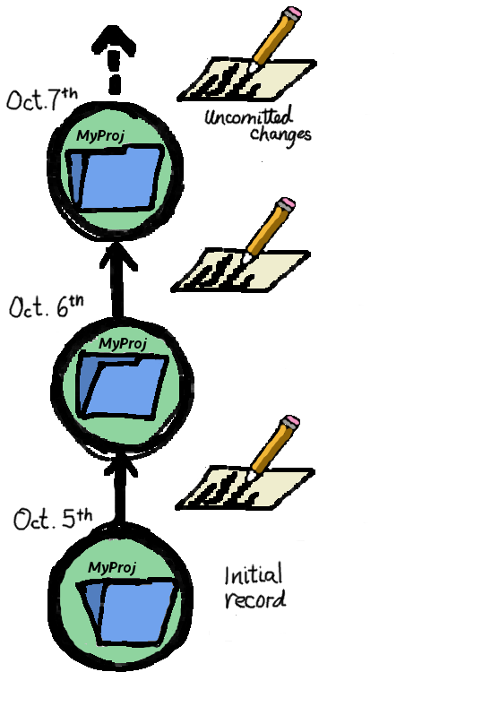

## Some simple steps to success!

1. Start a new repository (or download an existing one). 
What is a repository, you ask? A repository is a folder in which you store your project. The folder saves previous versions of your project and allows you to easily access them. 
  For example:

``` {r, eval=FALSE}
#Create a brand new repository in a new or existing local project. Defaults to your current working directory
create_repo("~/Desktop/myproject")

#Download an existing repository from online
download_repo("url")
```
  
  
2. Make some changes: work on your project as normal. Don't forget to save your changes. 
  [insert picture/code here]


3. Review and visualise the changes you have made to your project.
  [insert picture here]

```{r eval=FALSE}
changes()
```

4. Once you are happy with your changes, record them in your repository. Your repository records a snapshot of your current project, adding it to the list of previous versions.   
  [insert picture here]

``` {r eval=FALSE}
# automatically performs all of the steps to record your changes in your repository
record("a message to your future self")

```


## Fixing stuff, moving back, recording stuff

5. Look at your history of records

```{r eval=FALSE}
# print a history of your past records in your console:
timeline()
```


6.  Fixing stuff!

```{r eval=FALSE}   
# Made a mistake? Return your project to your last record:
scrub()

# ...or to another previous record of your choice:
retrieve(1)

# take a peek into any older record 
go_to(2)

```

7. Saving stuff online
When you work on your computer, you are usually working in what is called the 'local' environment. The local environment encompasses anything housed on your computer's hard drive. If you want to collaborate or make your work available to others, it's a good idea to put it 'in the cloud,' in other words, in a 'remote' repository. These are housed on a server somewhere else in the world, and can be accessed online. This can also provide additional safety in case you lose your work in your local environment. 
 
```{r eval=FALSE}
# Synchronize your work with a new or existing remote repository
sync("url")  # (not yet implemented)
```
   


# An example workflow

```{r eval=FALSE}
# load the package
library(stow)

# make a new repository in your working directory
# (you only need to do this the first time you work with the project)
create_repo("~/Desktop/myproject")

# tell the repository if there are files (e.g. large data output files) you
# don't want to keep copies of
ignore("output/results.csv")

# (you can always change your mind)
unignore("output/results.csv")

# work on your project as normal, and save your changes
cat("this is fun!\n", file = "README.md", append = TRUE)

# see which files have changed
changes()

# record the changes you have made
record("added stuff to readme")

# you can keep working on and adding files in this folder, and recording your
# changes regularly with record()

# If you make a change you don't want to keep, you can undo them and go back to
# your last record with scrub()
cat("I could do this all day.\n", file = "README.md", append = TRUE)
changes()
scrub()
changes()

# you can look at your history of records...
timeline()

# ... and go back in time to recover the project at any one of your records
go_to(2)

# all of the files will have been changed back to how they were at record 2
timeline()

# we can always go back to the future
go_to(3)

# if you want to start again from a previous record, you can do retrieve() to
# bring that record to the end of your timeline 
retrieve(2)
# all the work you recorded since then will still be stored, in case you need it
# later
```
